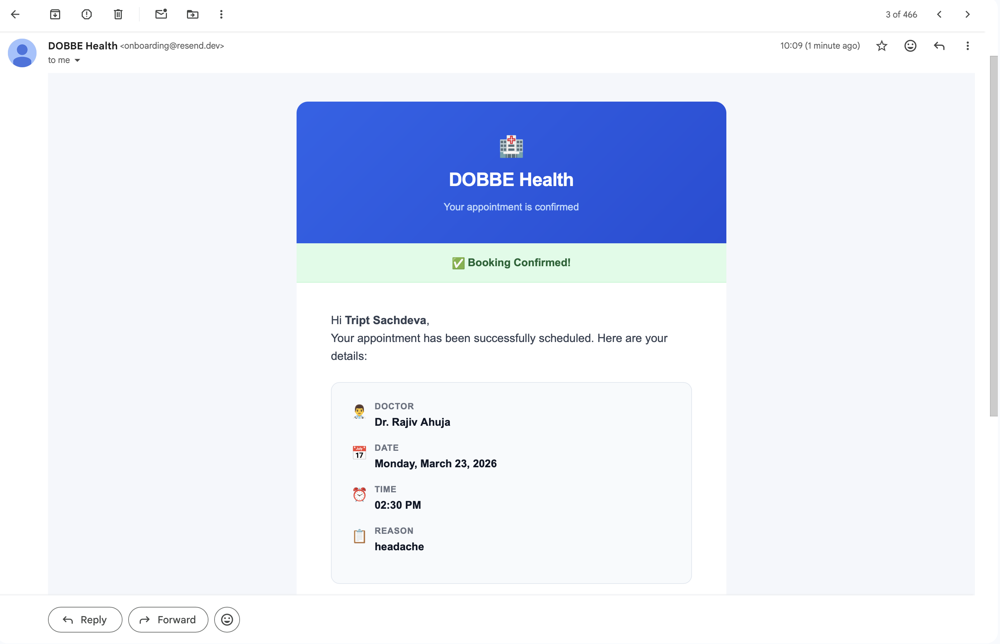
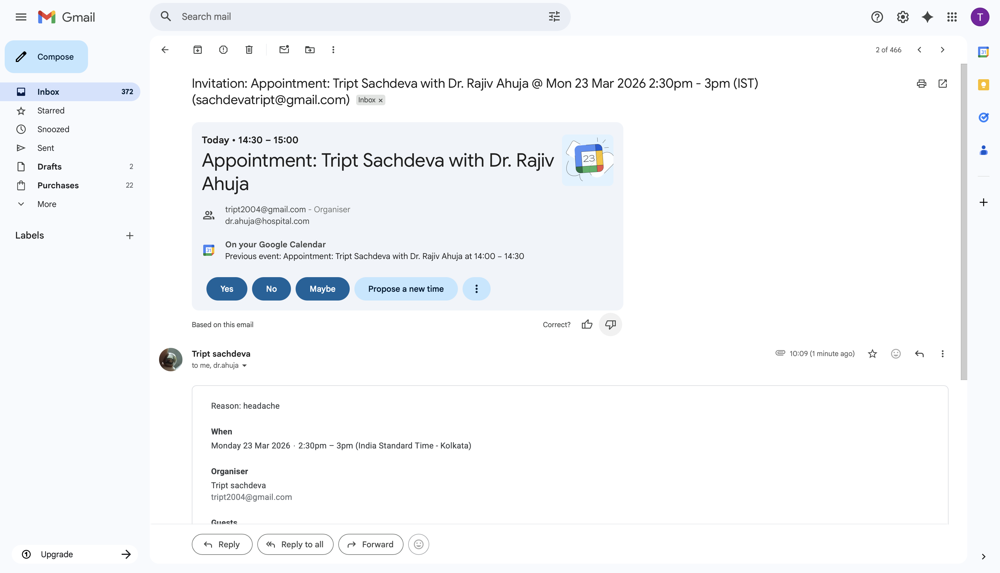
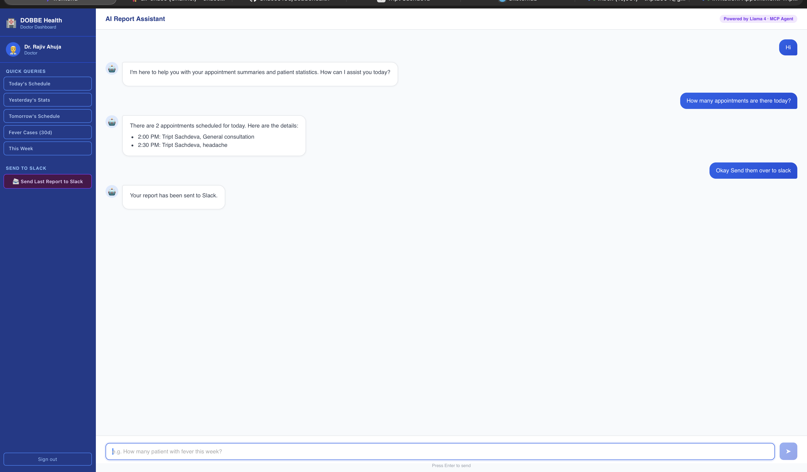
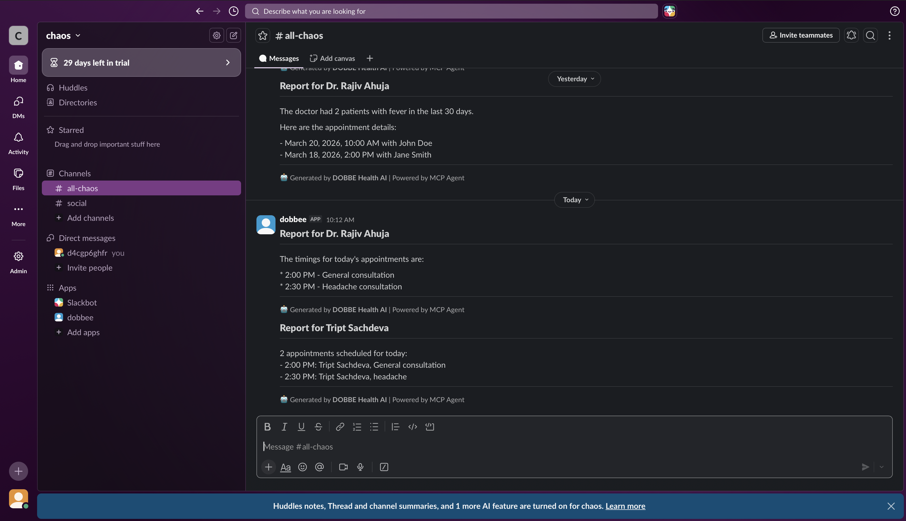

# DOBBE AI — Agentic Doctor Appointment Assistant

A full-stack AI application built for the **Full-Stack Developer Intern Assignment**. Uses **MCP (Model Context Protocol)** to dynamically expose backend tools to an LLM agent, enabling natural language appointment booking, smart auto-rescheduling, doctor reporting, and Slack notifications.

---

## Screenshots

### Login / Register


### Patient — Appointment Booking


### Email Confirmation


### Google Calendar Event


### Doctor — Summary Report Dashboard


### Slack Notification


---

## Assignment Coverage

| Requirement | Status |
|---|---|
| Scenario 1 — Patient appointment booking via natural language | ✅ |
| MCP tool exposure (availability, booking, email) | ✅ |
| Google Calendar API integration | ✅ |
| Email confirmation (Resend) | ✅ |
| Multi-turn conversation support | ✅ |
| Scenario 2 — Doctor summary report via natural language | ✅ |
| Non-email notification — Slack Block Kit | ✅ |
| Dashboard button to trigger report + Slack | ✅ |
| Role-based login (patient vs doctor) ⭐ Bonus | ✅ |
| LLM-powered auto-rescheduling ⭐ Bonus | ✅ |
| Prompt history tracking ⭐ Bonus | ✅ |

---

## Architecture

```
React Frontend (port 3000)
      │
      ▼
FastAPI Backend (port 8000)
      │
      ├── MCP Client (agent/orchestrator.py)
      │        │  tools/list — discovers tools dynamically at runtime
      │        │  tools/call — executes tools via MCP protocol
      │        ▼
      │   MCP Server (port 8001, SSE transport)
      │        ├── check_availability          → PostgreSQL
      │        ├── list_doctors                → PostgreSQL
      │        ├── book_appointment            → PostgreSQL + Google Calendar
      │        ├── cancel_appointment          → PostgreSQL + Google Calendar
      │        ├── send_confirmation_email     → Resend API
      │        ├── get_appointment_stats       → PostgreSQL
      │        ├── get_appointments_by_symptom → PostgreSQL
      │        ├── send_slack_report           → Slack Block Kit API
      │        ├── find_next_available_slot    → PostgreSQL (auto-reschedule)
      │        └── reschedule_appointment      → PostgreSQL
      │
      └── Groq API — Llama 4 Scout 17B — drives all tool orchestration
```

**Key MCP principle:** Tools are discovered dynamically via `tools/list`. The LLM decides which tools to call based on descriptions alone — no hardcoded `if/else` routing anywhere in the backend.

---

## Features

### Scenario 1 — Patient Appointment Booking
- Natural language: _"Book Dr. Ahuja for tomorrow morning"_
- Agent: checks availability → books → creates Google Calendar event → sends email
- Multi-turn: _"Book the 3 PM slot"_ works after listing availability (no intent restatement needed)
- Auto-rescheduling: if preferred slot is full, `find_next_available_slot` finds the next free slot

### Scenario 2 — Doctor Reports + Slack Notification
- _"How many patients yesterday?"_ → LLM queries DB → formatted human-readable report
- _"How many patients with fever in last 30 days?"_ → symptom-based stats
- Send report to Slack: one-button click on dashboard OR natural language _"send to Slack"_
- Slack delivery is direct (not LLM-mediated) — guaranteed to fire every time

### Bonus Features
- **Role-based JWT auth** — patients see chat UI, doctors see reporting dashboard
- **Auto-rescheduling** — `find_next_available_slot` + `reschedule_appointment` MCP tools
- **Prompt history** — all sessions stored in DB, sidebar shows conversation history

---

## Tech Stack

| Layer | Technology |
|---|---|
| Frontend | React 18 + Vite + React Router |
| Backend | FastAPI (fully async) |
| MCP | `mcp` Python SDK — FastMCP, SSE transport |
| LLM | Groq API — Llama 4 Scout 17B (free tier) |
| Database | PostgreSQL 15 (Docker) |
| Scheduling | Google Calendar API |
| Email | Resend API |
| Notifications | Slack Block Kit API |
| Auth | JWT (python-jose) + bcrypt |

---

## Setup Guide

### Prerequisites
- Docker Desktop
- Node.js 18+
- Python 3.11+

### 1. Clone & enter project
```bash
git clone https://github.com/Chaos0168/dobbehealth
cd dobbehealth
```

### 2. Start Database
```bash
docker compose up -d
```
- PostgreSQL runs on `localhost:5432`
- pgAdmin UI: `http://localhost:5050` — login: `admin@dobbe.com` / `admin123`

### 3. Configure environment
```bash
cp backend/.env.example backend/.env
```
Fill in `backend/.env`:
```env
GROQ_API_KEY=gsk_...
RESEND_API_KEY=re_...
SLACK_BOT_TOKEN=xoxb-...
SLACK_CHANNEL_ID=C0XXXXXXX
```

### 4. Backend setup
```bash
cd backend
python3 -m venv venv
source venv/bin/activate        # Windows: venv\Scripts\activate
pip install -r requirements.txt
```

### 5. Authorize Google Calendar (one-time)
```bash
# Inside backend/ with venv active
python services/auth_calendar.py
```
This opens a browser → sign in → grant access → saves `google_token.json`.

### 6. Start MCP Server
```bash
# Terminal 1 — inside backend/ with venv active
python -m mcp_server.server
```

### 7. Start FastAPI
```bash
# Terminal 2 — inside backend/ with venv active
uvicorn main:app --reload --port 8000
```
Swagger docs: `http://localhost:8000/docs`

### 8. Start Frontend
```bash
cd frontend
npm install
npm run dev -- --port 3000
```
Open: `http://localhost:3000`

### One-command startup (all services)
```bash
./start.sh
```

---

## API Keys Setup

### Groq (LLM — Free)
1. [console.groq.com](https://console.groq.com) → API Keys → Create Key
2. Add to `.env` as `GROQ_API_KEY`

### Resend (Email — Free)
1. [resend.com](https://resend.com) → API Keys → Create
2. Add to `.env` as `RESEND_API_KEY`
3. Use `onboarding@resend.dev` as `FROM_EMAIL` for dev (no domain needed)

### Slack
1. [api.slack.com/apps](https://api.slack.com/apps) → Create New App → From Scratch
2. OAuth & Permissions → Add `chat:write` scope → Install to Workspace
3. Copy Bot Token (`xoxb-...`) → add as `SLACK_BOT_TOKEN`
4. Create channel `#doctor-notifications` → invite the bot → right-click channel → Copy Channel ID → add as `SLACK_CHANNEL_ID`

### Google Calendar
1. [console.cloud.google.com](https://console.cloud.google.com) → New Project → Enable Calendar API
2. Credentials → Create → OAuth 2.0 Client ID → Desktop app → Download JSON
3. Save as `backend/services/google_credentials.json`
4. Run `python services/auth_calendar.py` once to authorize

---

## API Usage Summary

### Auth
| Endpoint | Method | Description |
|---|---|---|
| `/api/auth/register` | POST | Register patient or doctor |
| `/api/auth/login` | POST | Login → returns JWT token |

### Patient Chat (Scenario 1)
| Endpoint | Method | Description |
|---|---|---|
| `/api/chat/` | POST | Send message to patient agent — booking, availability, cancellation |

### Doctor Dashboard (Scenario 2)
| Endpoint | Method | Description |
|---|---|---|
| `/api/doctor/report` | POST | Ask doctor agent a question — returns report |
| `/api/doctor/report/send-slack` | POST | Generate report AND send directly to Slack |

All protected endpoints require `Authorization: Bearer <token>` header.

---

## Sample Prompts

### Patient — login: `tript@patient.com` / `password123`
```
"Show me all available doctors"
"Check Dr. Ahuja's availability for tomorrow"
"Book the 9 AM slot with Dr. Ahuja for a checkup"
"I want to see Dr. Sharma on Friday afternoon"
"Reschedule my appointment to next Monday"
"Cancel my appointment"
```

### Doctor — login: `dr.ahuja@hospital.com` / `password123`
```
"How many patients visited yesterday?"
"How many appointments do I have today?"
"What does tomorrow's schedule look like?"
"How many patients with fever in the last 30 days?"
"Give me a full summary for this week"
```

---

## Project Structure

```
dobbehealth/
├── docker-compose.yml           # PostgreSQL + pgAdmin
├── start.sh                     # One-command startup
├── ASSIGNMENT.md                # Original assignment brief
├── database/
│   └── schema.sql               # PostgreSQL table definitions
├── backend/
│   ├── main.py                  # FastAPI app + CORS + routes
│   ├── config.py                # Pydantic settings (reads .env)
│   ├── requirements.txt
│   ├── .env.example
│   ├── mcp_server/
│   │   ├── server.py            # FastMCP server — SSE on port 8001
│   │   └── tools/
│   │       ├── availability.py  # list_doctors, check_availability
│   │       ├── booking.py       # book_appointment, cancel_appointment
│   │       ├── stats.py         # get_appointment_stats, get_by_symptom
│   │       ├── email_tool.py    # send_confirmation_email (Resend)
│   │       ├── slack_tool.py    # send_slack_report + send_slack_direct
│   │       └── reschedule.py    # find_next_available_slot, reschedule_appointment
│   ├── agent/
│   │   └── orchestrator.py      # MCP client + Groq agentic loop
│   ├── routes/
│   │   ├── auth.py              # /api/auth/register, /login
│   │   ├── chat.py              # /api/chat/
│   │   └── doctor.py            # /api/doctor/report, /report/send-slack
│   ├── models/
│   │   ├── database.py          # Async SQLAlchemy engine + session
│   │   ├── orm.py               # ORM models (User, Doctor, Appointment, etc.)
│   │   ├── schemas.py           # Pydantic request/response schemas
│   │   └── auth_utils.py        # JWT encode/decode + bcrypt
│   └── services/
│       ├── gcalendar.py         # Google Calendar create/delete events
│       └── auth_calendar.py     # One-time OAuth2 authorization script
└── frontend/
    └── src/
        ├── App.jsx              # Router + protected routes
        ├── api.js               # Axios client with JWT interceptor
        ├── context/AuthContext.jsx
        └── pages/
            ├── Login.jsx
            ├── Register.jsx
            ├── PatientChat.jsx      # Chat UI + session history sidebar
            └── DoctorDashboard.jsx  # Report UI + quick queries + Slack button
```
